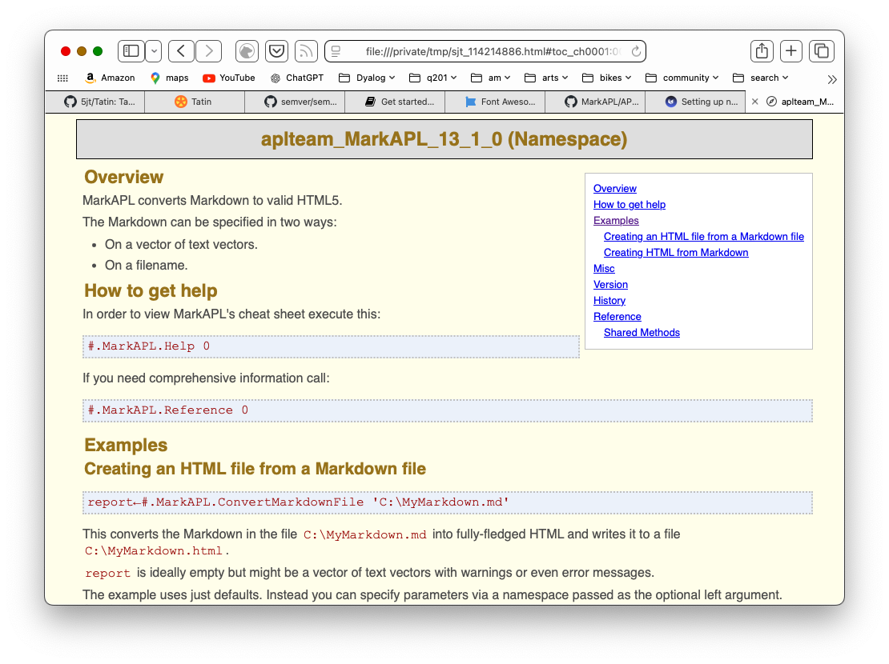

# Get started with Tatin


!!! abstract "Install, load and use a Tatin package"


## Install

=== "Dyalog 19.0"

    Tatin is already installed. Activate it.

        ]Activate Tatin

=== "Dyalog 18.2"

    See [Older Versions](older-versions.md).


## Look for registries


Initially Tatin knows only the principal and test Tatin registries.

```
      ]TATIN.ListRegistries
 Alias       URL                      ID          
 ----------  -----------------------  -------     
 tatin       https://tatin.dev/       29fbeb2 ... 
 tatin-test  https://test.tatin.dev/  2a28231 ... 
```

When you want to start using other Tatin registries, remote or on your local machine, edit the [user settings](user-settings.md).


## Look for packages

List all the packages on the principal registry.

```
      ]TATIN.ListPackages
 Registry: https://tatin.dev              ≢ 60
 Group & Name                 # major versions
 ------------                 ----------------
 abrudz-sort                                 1
 aplteam-ADOC                                1
 aplteam-APLGit2                             1
 aplteam-APLGUI                              1
 aplteam-APLProcess                          1
 ...
```
Each package is identifed by a name and group name.
The listing shows the number of major versions of the package.

:fontawesome-solid-arrow-up-right-from-square: [Semantic versioning](https://semver.org)

You can restrict the listing to a single group.

    ]TATIN.ListPackages -group=davin

Packages are tagged.
```
      ]TATIN.ListTags
 All tags from https://tatin.dev
 -------------------------------
  data
  grid
  import
  page
  read
  ...

      ]TATIN.ListPackages -tag=markdown
 Registry: https://tatin.dev               ≢ 4
 Group & Name                 # major versions
 ------------                 ----------------
 aplteam-Laguntza                            2
 aplteam-MarkAPL                             3
```

## Install packages

Suppose you want to use the `MarkAPL` package in an application you are developing, which we will call a project.
Suppose the project lives in `/Foo`.

Install the package as part of the Foo project.
```
      ]TATIN.InstallPackages MarkAPL /Foo/packages

Sure you want to create and install into
/Foo/packages ? (Y/n) Y
 Installed into /Foo/packages:
  aplteam-MarkAPL-13.1.0
 In order to load all dependecies (including newly installed ones) into the WS execute:
       ]Tatin.LoadDependencies "/Foo/packages"
```
`MarkAPL` specifies neither group nor version number.
The name is unique on the principal registry; the latest version is installed by default.

The `/Foo/packages` folder has been created and contains:

    apl-buildlist.json
    apl-dependencies.txt
    aplteam-APLTreeUtils2-1.4.0
    aplteam-CommTools-1.8.1
    aplteam-FilesAndDirs-5.8.0
    aplteam-MarkAPL-13.1.0
    aplteam-OS-3.1.1

(You might see different version numbers.)


## Load packages

MarkAPL has been installed in the project.
Now load it into the active workspace.

MarkAPL is one (the only one) of the dependencies of Foo.
```
      ]tatin.LoadDependencies /Foo/packages #.Foo
#._tatin.aplteam_MarkAPL_11_0_1
```

!!! tip "Tatin is taciturn"

    Tatin works quietly by default.
    Use the `-verbose` flag if you need to see more of what is going on when packages are loaded.


## Documentation

We now have `#.Foo.MarkAPL` loaded – but how do we use it?

!!! tip "The ADoc convention lets Tatin packages include their own documentation."

```
      ]ADoc #.Foo.MarkAPL
]Open /private/tmp/sjt_114214886.html
Watch your browser
```
Executing the `]Open` user command pops a browser window.
```
      ]Open /private/tmp/sjt_114214886.html
```




## Test

Test an example from the documentation.
```apl
      MyMarkdown←'# MarkAPL' 'All about **_MarkAPL_**'
      (html ns)←#.Foo.MarkAPL.Markdown2HTML MyMarkdown
      ↑html
<div class="h_tag">
<a href="#markapl" id="markapl" class="autoheader_anchor">
<h1 data-id="MarkAPL">MarkAPL</h1>
</a>
</div>
<p>All about <strong><em>MarkAPL</em></strong></p>
      ns
#._tatin.aplteam_MarkAPL_13_1_0.[Namespace]
```
**Congratulations** You have installed a Tatin package in your project, loaded it into your active workspace, and confirmed you can use it.


!!! warning inline end "Cider depends on Tatin"

    If you use Cider:

    -   Deactivate and remove it before Tatin
    -   Re/Install Tatin before Cider.

## :fontawesome-solid-trash-can: Deactivate

To remove Tatin and/or Cider from the installation folder:

    ]Deactivate [all|cider|tatin] [-versionagnostic]


<!-- ## :dyalog-cider-logo: Cider -->


<!-- FIXME move elsewhere
### Installing several packages at once

Note that `InstallPackages` accepts several package IDs, separated by commas:

```
      ]tatin.InstallPackages Tester2,MarkAPL,Laguntza /Foo/packages
```

This will load three packages and all their dependencies at once. You might find this significantly faster than installing them one-by-one.

!> ### Using an alias for a package
=> It is possible to use an alias for a package. Check this example:
=> ```
=> ]tatin.InstallPackages F@FilesAndDirs
=> ```
=> This creates a ref `F` for FilesAndDirs. However, the purpose of such aliases is not to allow you to create
=> a kind of shortcut for the package in question, this allows you to load to different versions of a package,
=> something that is sometimes required due to specific requirements.
=>
=> All you need to do is to assign different aliases to the different versions of the package.


### Checking out a package: `LoadPackages`

Let's assume that before actually installing it, you first  want to check whether the package `MarkAPL` suits your needs. In this case you might not want to install it (yet) but just to load it into the workspace.

That can be achieved with the `LoadPackages` user command. It loads the package into the workspace.


Notes:

* Loading a package in this way has one major purpose: to investigate it.

* Loading a package might well be different from installing a package: when loading a package the precise versions of dependency packages will be loaded, but when a package is installed that is not necessarily the case.

  This is discussed in the paper `TatinsLoadAndUpdateStrategy.html`


Let's load the `MarkAPL` package into the workspace; for that we need to specify a URL and optionally a target namespace:

```
      ]tatin.LoadPackages [tatin]MarkAPL -verbose
  Attempting to install https://tatin.dev/aplteam-MarkAPL-10.0.0...
  Establish dependencies...
  4 dependencies identified
  Fetching https://tatin.dev/aplteam-MarkAPL-10.0.0...
  Unzipping C:\Users\username\AppData\Local\Temp\...
  Add aplteam-MarkAPL-10.0.0 to dependency file...
  Fetching https://tatin.dev/aplteam-APLTreeUtils2-1.1.0...
  ...
```

I> Without `-verbose` the command is taciturn:
I> ```
I> ]tatin.LoadPackages [tatin]MarkAPL
I> 4 packages (including dependencies) loaded
I> ```

Here we did not specify a target namespace, so the package was loaded into `#`. In case the target namespace is something like `#.MyTests` then it may or may not exist. If it does not, Tatin will create it.

Tatin has created a reference named `MarkAPL` in the target namespace `#`:

```
      #.⎕nl ⍳16
MarkAPL
_tatin
```

That reference points to the namespace that holds the package as such, which is loaded into `_tatin`: this is the namespace Tatin uses to manage all packages.

I> The name `_tatin` is hard-coded and _cannot_ be changed.

The name of the namespace carries the version number:

```
      #.MarkAPL
#._tatin.aplteam_MarkAPL_10_0_0
```
`_tatin` also contains all the packages `MarkAPL` depends on:

```
      #._tatin.⎕nl ⍳16
aplteam_APLTreeUtils2_1_1_0
aplteam_FilesAndDirs_5_0_0
aplteam_MarkAPL_10_0_0
aplteam_OS_3_0_0
```

No matter whether the APL code of a package is a single function (or operator) or a bunch of functions and operators or a single namespace (ordinary or scripted) or a bunch of namespaces or a single class or a bunch of classes or a mixture of all these APL objects, they are going to live in the top namespace of a package.

But Tatin will also inject references into that namespace pointing to the dependencies, therefore:

```
      #._tatin.aplteam_MarkAPL_11_0_0.⎕nl⍳16
APLTreeUtils2
FilesAndDirs
MarkAPL
```

`MarkAPL` is the package we asked for. It depends on two packages, `APLTreeUtils2` and `FilesAndDirs`. For these two packages references are injected. `FilesAndDirs` depends on `OS` but because that is not required by `MarkAPL`, no reference to `OS` is injected into `aplteam_MarkAPL_11_0_0.`, but you would find such a reference in `#._tatin.aplteam_FilesAndDirs_5_0_1`.


### Misc

#### Scanning Registries

The fact that Tatin scans Registries in order to find a package can be put to good use when developing packages:
you can run your own Tatin server on, say, your own machine, and give it the highest priority. You can then publish new versions of a package on that server first.

That way Tatin would find the package on your local machine even when they are not loaded as principal packages but just as dependencies.

Later, when the package is ready, you could publish it to, say, the principal Tatin server on `https://tatin.dev`, and --- don't forget that step! --- delete it from your local Registry.


A> ### Having the same package in more than one Registry
A>
A> In case you juggle with the same package in several Registries you might well be interested in getting a full list.
A> The `]ListPackages` user command has a syntax for this:
A>
A> ```
A>       ]ListVersions [*]example-versions
A> ```
A>
A> This would check all known Registries with a priority greater than 0 for `example-versions`, and list all hits.

The fact that Registries with a priority of `0` are not scanned by Tatin allows you to include a Registry like `https://test.tatin.dev` in your user settings. You don't really want that Registry to participate in a scan, but that way you can still execute commands like `]tatin.ListPackages` etc. on it.

A> ### Scanning for dependencies
A>
A> Note that Tatin does not only scan all known Registries with a priority greater than zero for principal packages, it also scans all those Registries for dependencies as well.


#### Deprecated packages

Every piece of software will become obsolete one day. Packages are no exception. If a package is not needed anymore, or is obsolete because there is a better one available, it's time to mark it as deprecated.

This can be done with the user command `]Tatin.DeprecatePackage`. In short what the user command does is to publish the latest version available yet as a new version with an increased minor version number and an injected flag `deprecated←1`

A> ### Deleting versus deprecating packages
A>
A> Depending on the delete policy operated on a server you might as well delete all obsolete packages, but we discourage you from doing so.
A>
A> The reason is that one of Tatin's design goals was to make a build 100% reproducible. This is only achievable if packages are not deleted from a server. That's the reason why the principal Tatin Registry operates a non-delete policy.

For example, let's assume these three packages are published:


```
aplteam-Foo-1.0.0
aplteam-Foo-1.1.0
aplteam-Foo-1.1.1
```

Executing:

```
]Tatin.DeprecatePackage https://your-Registry/aplteam-Foo-1
```

will publish a new version `aplteam-Foo-1.2.0` which is almost identical with version 1.1.1 except that it has two additional properties in its config file: `deprecated` with the value 1 and `deprecate_comment` which carries the comment in case you've specified one with `-comment=`; this should be used to explain why a package got marked as deprecated, so it will be something along the lines of "See package Foo-Boo".

From now on both the "Packages" web page and `]Tatin.ListPackages` won't list these four packages anymore.

Note that `]Tatin.ListDeprecated` is designed to list just the deprecated packages. If you want the list to include also the earlier versions --- which are now sort of hidden by 1.2.0 --- then you need to specify the `-all` flag.

With `-all` a matrix with two columns rather than one is returned, with the second column carrying an asterisk for those packages that actually  do carry `deprecated←1` in their config file. That would be at least the very last one.

##### Side effects of deprecating a package

If you try to load or install a package that is marked as deprecated then you will be asked whether you really want that, but if you insist then you will get what you asked for.

Note however that this is only true when you ask explicitly for the last package (the one with `deprecated←1`).

In our example that would be:

```
]Tatin.LoadPackages https://your-registry/aplteam-Foo-1
```

This statement:

```
]Tatin.LoadPackages https://your-registry/aplteam-Foo
```

would yield the same result, but only because there is just one major version anyway.

If you ask _explicitly_ for an _earlier_ version than the deprecated one,  then that version would be loaded (or installed) without further ado, because Tatin would just assume that you know what you are doing.

Note that the API functions for loading / installing packages would not complain or warn you at all.

A> ### Mistakenly deprecated a package?
A>
A> There is an easy escape route: just publish the package again with an increased minor version number but `deprecated` either set to 0 or removed from the config file, and the package is back on track.
A>
A> If `deprecate_comment` was not empty then that should be removed or emptied.
A>
A> Once you've done that the very latest published package would no longer carry a "deprecated" flag with the value 1, and therefore it would no longer fulfil the criteria of a deprecated package.


#### Tatin Variables

For every package Tatin will establish a couple of constants. Because APL has no concept of constants, they are emulated via niladic functions.

They are injected into a namespace `TatinVars` which in turn is injected into the top package namespace.

W> Of course this means that theoretically there could be a name clash, but then the name `TatinVars` should certainly not be used by any package author.

Strictly speaking `TatinVars` is a misnomer because the namespace carries just functions, and not a single variable, but all but one of those act as constants, and the exception `GetFullPath2-AssetsFolder` was introduced at a later stage, so it was decided to stick with the name `TatinVars` for compatability.

Note that we refer to, say, `HOME` as a character vector because the niladic function `HOME` returns a character vector.


##### ASSETS

The path to the package's assets relative to `HOME`. Is empty in case there are no assets.

See also the [GetFullPath2AssetsFolder](#GetFullPath2AssetsFolder) function.


##### CONFIG

This is a simple character vector that stems from the file `apl-package.json` of the given package.


##### DEPENDENCIES

A vector of character vectors with the package IDs of the packages the package in question depends on.


##### GetFullPath2AssetsFolder

This is a function which returns the result of the expression `HOME,'/',ASSETS` if both `HOME` and `ASSETS` are not empty _and_ `HOME` exists on disk. If `HOME` is empty or does not exist on disk then just `ASSETS` is returned.

When accessing assets you are advised to always use the `GetFullPath2AssetsFolder` function. Why? Imagine the following scenario as an example: you've loaded packages into a clear workspace, set `⎕WSID` and then saved that WS. Later you make sure that the assets folder of the package becomes a sibling of the workspace. You might than move the WS with the assets folder elsewhere, even to a different machine. The expression `HOME,'/',ASSETS` would then fail.

But the function `GetFullPath2AssetsFolder` would not find `HOME` and therefore return just `ASSETS`, and that allows you to still access the assets sucessfully, assuming that you changed the current directory to where the workspace was loaded from.


##### HOME

Is a character vector holding the path of a folder that hosts the package.

There is an exception: when the package was brought into the workspace with `LoadPackages` rather than `LoadDependencies` that has no assets. This is because without assets `LoadPackages` loads the package into a temp folder, brings the package into the WS and then deletes the temp folder, because without assets there is no need to leave a footprint behind.

In this case `HOME` returns an empty vector.


##### ID

The full package name. This will include a build ID if there is any, so it is not necessarily identical with the package ID.


##### LX

In a package config file a function can be defined on the `lx` parameter. Such a function would be executed after the package was loaded. The purpose of the function is to perform some sort of initialisation.

If such a function returns a result then it is assigned to `LX` in the `TatinVars` namespace.

Note that `LX` does not exist in case no such function is defined, or the function did not return a result.


##### URI

Character vector that holds the address of a Tatin server the package was loaded from, or the full name of a ZIP file.

 -->