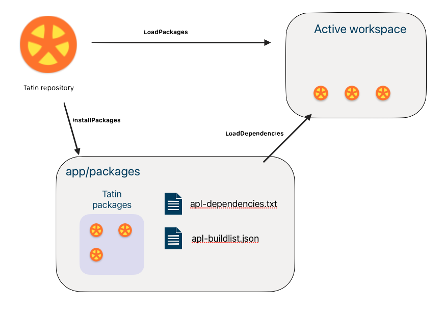

# Tatin’s load and update strategy

!!! abstract "How Tatin implements semantic versioning when loading and updating packages"


## Minimum version selection

Suppose you need packages, `Foo` and `Goo`.
Both rely on package `Zoo`; but while `Foo` requests `Zoo` 1.1.1,
`Goo` requires version 1.2.0.

             Zoo-1.0.0
             Zoo-1.1.0
    Foo ---> Zoo-1.1.1
    Goo ---> Zoo-1.2.0
             Zoo-1.3.0
             Zoo-2.0.0

The best available version 1 of `Zoo` is 1.3.0.
There is also a later major version: 2.0.0.

Version 2.0.0 is not an option, because it is considered a completely different package and so ignored.

From [semantic versioning](versioning.md) we know `Goo` relies on features of `Zoo` new in version 1.2.0: `Goo` would crash on version 1.1.1, which doesn’t have them.

### Strategic options

Several strategies are possible:

1.  Load both versions of `Zoo` and let `Foo` use 1.1.1 and `Goo` 1.2.0.
1.  Load `Zoo` version 1.2.0 and let `Zoo` and `Goo` both use that version.
1.  Check the server, load the latest version available (1.3.0) and use that.

Each of these options is used by different package managers in the wild.
There is no consensus on what is best.

Strategy (3) appeals to many programmers: you are always up-to-date, and you always get the latest fixes when you build your application. Great!

But on reflection it looks much less appealing:

1. Build your application, including updated dependencies
1. Run your test cases; they all pass :fontawesome-solid-check:
1. Rebuild your application without changing _anything_
1. Rerun your test cases; but this time they fail :fontawesome-solid-xmark:

This situation arises if, between the first and second build, the author of a dependency releases a new version with bugs in it. The second build fetches it,
producing a different outcome – even though you haven’t made any changes.


### Tatin’s strategy

As appealing as an automated update mechanism might seem, you’d want your builds to be 100% reproducible, right?

So, when asked to load installed packages, Tatin will do exactly that: 

-   load the packages defined as required by the configuration files of the main packages `Foo` and `Goo`
-   **except** When a package is requested _more than once_, and with different minor and/or patch numbers, Tatin uses _the latest installed version_, which might or might not be the latest one available

In our example

-   `Zoo` is requested and installed twice
-   Tatin loads 1.2.0 just once (because it is requested by `Goo`)
-   1.3.0 is ignored because it is not requested and so not installed

This means `Foo` will also use version 1.2.0 of `Zoo`.

This strategy is called ["Minimal Version Selection"](https://research.swtch.com/vgo-mvs "Link to the paper defining it"). It guarantees that when you rebuild you get the same result, but it will grab the latest installed version.


!!! tip "Updating dependencies"

    Tatin does not update dependencies for you,
    but helps you discover whether later packages are available.
    
    :fontawesome-solid-terminal:
    [`]TATIN.CheckForLaterVersions`](user-commands.md#check-for-later-versions)<br>
    :fontawesome-solid-terminal:
    [`]TATIN.ReInstallDependencies -flag`](user-commands.md#reinstall-dependencies)<br>
    :fontawesome-solid-code:
    [`⎕SE.Tatin.ReInstallDependencies`](api.md#reinstall-dependencies)

We will discuss this in a minute.

### Forcing updates

Suppose a package of yours depends on someone else’s package `Foo`, which in turn depends on `Goo` 1.1.0 – and while using `Foo` you stumble over a bug in `Goo` 1.1.0.

You write to the author of `Foo`, pointing out that `Goo` 1.1.1 is available and fixes that very bug, but the author does not reply, or tells you that she will produce and publish a new version in the two weeks you have to your deadline.

**Solution**
Create a package `Dummy` that does nothing, but declares a dependency on `Goo` 1.1.1.
_Voila!_ Thanks to minimum version selection, everything works.


## Loading dependencies

Imagine these packages all hosted by a Tatin server with alias `MyTatin`.

    mygroup-Foo-1.0.0 ---> Zoo-1.1.1
    mygroup-Goo-2.1.0 ---> Zoo-1.2.0
                           Zoo-1.3.0

While `Foo` relies on `Zoo` 1.1.1, `Goo` needs `Zoo` 1.2.0.
What does Tatin do about this?

It depends on what you do.
Let’s first load `Zoo` and `Goo` into the workspace, the usual way to inspect a package:

```apl
      ]TATIN.LoadPackages [MyTatin]/mygroup-Foo-1.0.0 #.MyPkgs
#.MyPkgs.Foo
      ]TATIN.LoadPackages [MyTatin]/mygroup-Goo-2.1.0 #.MyPkgs
#.MyPkgs.Goo
      #.MyPkgs.⎕NL ⍳16
Foo
Goo
```

### Getting the latest version

<!-- FIXME What does Foo-1.3.0 depend on? -->
Suppose version 1.3.0 of `Foo` is the latest available with major number&nbsp;1,
then this would have been sufficient:

    ]TATIN.LoadPackages [MyTatin]/mygroup-Foo-1 #.MyPkgs

Note neither the minor nor the patch number has been specified.

Suppose version 2.1.0 of `Goo` is the very latest version available, and that’s the version you want to use,
then this would have been sufficient:

    ]TATIN.LoadPackages [MyTatin]/mygroup-Goo #.MyPkgs

In this case not even the major number has been specified.

You wanted `Foo` and `Goo` loaded into `#.MyPkgs`, and that's exactly what Tatin did.
But where are the dependencies?

Note `#.MyPkgs` just contains references to where the packages have been loaded into, the namespace `#._tatin`:

          #._tatin.⎕NL 9
    mygroup_Foo_1_0_0   
    mygroup_Goo_2_1_3 
    mygroup_Zoo_1_1_1 
    mygroup_Zoo_1_2_0

Both versions of `Zoo` have been loaded. 
That’s because the two `Load` operations are independent, so minimal version selection cannot be applied.

:fontawesome-solid-terminal:
command [`]CheckForLaterVersion`](user-commands.md#check-for-later-version)<br>
:fontawesome-solid-code: API
[`CheckForLaterVersion`](api.md#check-for-later-version)


## Installing packages

To incorporate packages into an application, they must be installed. 
In the following example, we install two packages, `Foo` and `Goo`. Both require `Zoo`, so `Zoo` gets installed as a side effect.

```apl
      ⎕NEXISTS '/myPkgs'
0
      ]TATIN.InstallPackages [MyTatin]/mygroup-Foo-1.0.0 /myPkgs/
/myPkgs/mygroup-Foo-1.0.0
      ]TATIN.InstallPackages [MyTatin]/mygroup-Goo-2.1.0 /myPkgs/
/myPkgs/mygroup-Goo-2.1.0
      ⍪⊃⎕NINFO ⍠ 1⊢'/myPkgs/*'
/myPkgs/apl-buildlist.json
/myPkgs/apl-dependencies.txt
/myPkgs/mygroup-Foo-1.0.0
/myPkgs/mygroup-Goo-2.1.0
/myPkgs/mygroup-Zoo-1.1.1
/myPkgs/mygroup-Zoo-1.2.0
```

Compare the dependency file and the build list:

```apl
      ⊃⎕NGET '/myPkgs/apl-dependencies.txt'    ⍝ dependency file
mygroup-Foo-1.0.0
mygroup-Goo-2.1.0

      json←⊃⎕NGET'/myPkgs/apl-buildlist.json'  ⍝ build list
      #.q←⎕JSON ⍠ ('Dialect' 'JSON5') ⊢ json
      ⍉↑#.q.(principal packageID)
1  mygroup-Foo-1.0.0
0  mygroup-Zoo-1.1.1
1  mygroup-Goo-2.1.0
0  mygroup-Zoo-1.2.0
```

Above, the first column flags the principal packages.

-   The **dependency file** lists the principal packages installed.
-   The **build list** comprises not only the two principal packages but also the dependencies.


## Loading installed packages

Loading packages puts them in your workspace;
installing packages puts them in your file system.

Loading _installed_ packages lets Tatin optimise what’s loaded.



Load installed packages with command [`]LoadDependencies`](user-commands.md#load-dependencies).
Its argument is a folder with files `apl-dependencies.txt` and `apl-buildlist.json`,
created when you installed your first package there.

You can also specify a second argument: where to create the references pointing to the principal packages.[^defaultns]

[^defaultns]: (Defaults to `#` if that is your current namespace. If you are, say, in `#.foo` then Tatin asks whether to install into `#` or `#.foo`.)

```
]TATIN.LoadDependencies /myPkgs/ #.Temp
```

If the command finds the dependency file is newer than the build list, it checks for inconsistencies: if none, it reconstructs the build list from scratch.

Then it prunes the build list and loads the remaining packages.

In our example the pruning eliminates `Zoo` 1.1.1:
rather than loading `Zoo` twice, Tatin loads only the latest **installed** version.
Both `Foo` and `Goo` will use `Zoo` version 1.2.0.


## Remove a principal package

Suppose you no longer need `Goo`.

To remove it, use either command [`]UnInstallPackage`](user-commands.md#uninstall-package) or API function [`UnInstallPackage`](api.md#uninstall-package).
This will remove not only the principal package, but any of its dependencies that are neither principal packages nor dependencies of other packages.

??? warning "Do not manually remove packages from your application’s packages folder."

    Tatin manages these dependency relations; don’t interfere.


## Implicit downgrading

Removing a principal package might imply a downgrade.

Consider, say, these packages (indentation defines dependency):

    group-foo-1.0.0
      group-zoo-1.1.0
    group-boo-1.0.0
      group-zoo-1.0.0

Minimal version selection (MVS) means both `foo` and `boo` use `zoo` 1.1 when loaded.
What happens if you remove `boo`?

It could be argued:

1.  `zoo-1.1.0` should survive this and still be used
1.  a package not required anywhere shouldn’t be used

A full implementation of MVS requires (1).
For the time being, Tatin uses (2) as a more pragmatic approach.

It is not obvious what is best here.
Tatin’s strategy might change after feedback.


## Add a package manually

To add a package that has no dependencies you could
just add it to the file `apl-dependencies.txt` 
and copy the package over.

That would not cause a problem.
When the `LoadDependencies` command is next issued,
Tatin sees the file `apl-dependencies.txt` changed after `apl-buildlist.json` was last modified,
performs some health checks, and if all is well, recreates the build list.
(This is insurance against people manually introducing errors into `apl-dependencies.txt`)


## Downgrade

Sometimes you might need to downgrade, for example from a version you find buggy, to an older version known to be okay. 

Tatin does not offer help here; you need to do this yourself.


